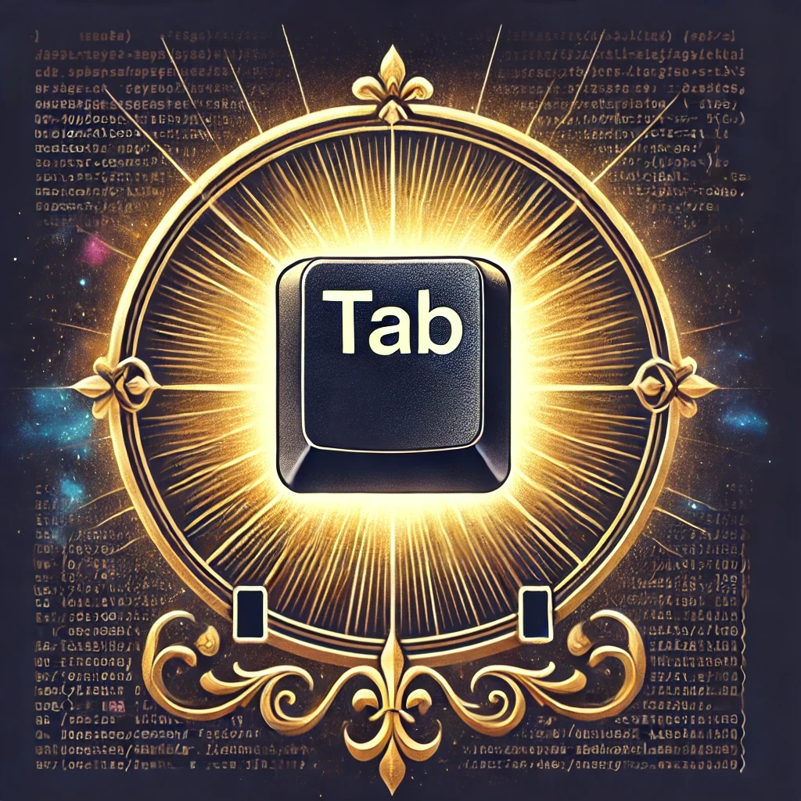

Visit https://tab.4x.re

Welcome to **The Holy Order of <kbd>Tab</kbd>**, a sacred community dedicated to the art and enlightenment of <kbd>Tab</kbd> completion. Our mission is to guide terminal users toward a brighter, more efficient future by spreading the gospel of autocomplete and reducing the burden of unnecessary keystrokes.





We believe that the **<kbd>Tab</kbd> key** is more than just a button—it’s a tool for productivity, a beacon of simplicity, and a savior from the chaos of mistyped commands. By embracing the power of <kbd>Tab</kbd>, you join a fellowship of enlightened individuals who have unlocked the secrets of the terminal and streamlined their workflows.

#### **Our Principles**:
1. **Efficiency Above All**: <kbd>Tab</kbd>  saves time and reduces frustration. Every keystroke matters.  
2. **Knowledge is Power**: Learn your tools, master your shell, and harness the full potential of <kbd>Tab</kbd>.  
3. **Share the Light**: Spread the wisdom of <kbd>Tab</kbd>  completion to all who remain in darkness.  

#### **Our Mission**:

To create a world where no terminal user types a full file path, command, or option again. Together, we can make autocomplete a universal practice, one keystroke at a time.


### **Get a Badge: Prove Your Devotion to The Holy Order of Tab**  

Choose your level of commitment and display your Tab prowess with pride! Whether you’re a humble novice or a grandmaster of Tab, there’s a title and badge just for you. Select your rank, customize your badge, and share it with the world to inspire others to join the Holy Order.

---

#### **Titles of Tab Nobility**  

1. **Novice of the Tab**  
   *“Every great journey begins with a single Tab.”*  
   - For new converts learning the ways of autocomplete.  
   - Badge:  
     )

```html
<a href="https://tab.4x.re"></a>
```


2. **Squire of Completion**  
   *“In service of the sacred Tab, progress is made.”*  
   - For users who understand basic Tab techniques and apply them daily.  
   - Badge:  
     )

```html
<a href="https://tab.4x.re"></a>
```


3. **Knight of Autocomplete**  
   *“Defender of efficiency, wielder of the Tab.”*  
   - For those fluent in autocomplete, navigating terminals with grace and precision.  
   - Badge:  
     )

```html
<a href="https://tab.4x.re"></a>
```

4. **Master of the Tab**  
   *“The Tab obeys their every command.”*  
   - For advanced users who harness Tab completion in all aspects of their workflow.  
   - Badge:  
     )

```html
<a href="https://tab.4x.re"></a>
```


5. **Grandmaster of Efficiency**  
   *“Time bends to their will; no keystroke is wasted.”*  
   - Reserved for elite Tab enthusiasts who complete even the most complex tasks with minimal effort.  
   - Badge:  
     )

```html
<a href="https://tab.4x.re"></a>
```

6. **Supreme ArchTabulator**  
   *“The pinnacle of Tab mastery, revered by all.”*  
   - For legends whose devotion to Tab knows no bounds.  
   - Badge:  
     )

```html
<a href="https://tab.4x.re"></a>
```

---

#### **How to Use Your Badge**  

1. Copy the badge url code chosen rank.  
2. Paste it into your GitHub README, personal website, or anywhere badges are celebrated.  
3. Display it proudly to show your allegiance to The Holy Order of Tab.  

---

**Show your rank, inspire others, and let the world know: In Tab, we trust.**
