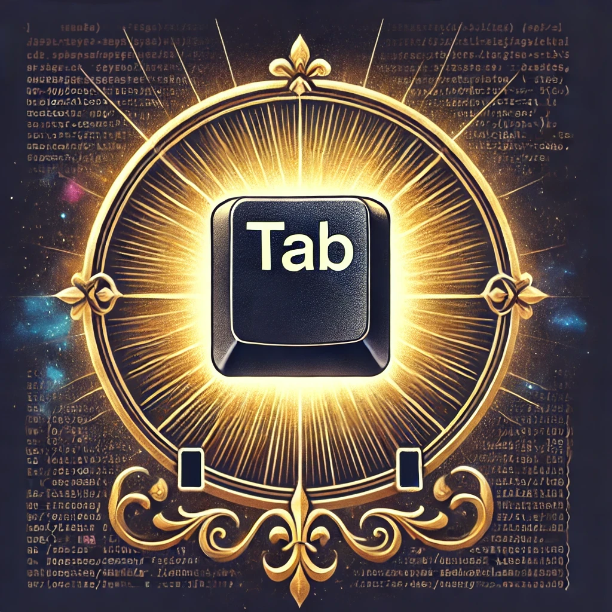

Bienvenue dans **l'Ordre du Saint <kbd>Tab</kbd>**, une communauté sacrée dédiée à l'art et à l'illumination de l'autocomplétion avec la touche <kbd>Tab</kbd>. Notre mission est de guider les utilisateurs de terminaux vers un avenir plus lumineux et plus efficace en répandant la sagesse de l'autocomplétion et en allégeant le fardeau des frappes inutiles.  

Nous croyons que la touche **<kbd>Tab</kbd>** est bien plus qu'un simple bouton : c'est un outil de productivité, un phare de simplicité, et un sauveur face au chaos des commandes mal saisies. En embrassant la puissance de la touche <kbd>Tab</kbd>, vous rejoignez une fraternité d'initiés éclairés qui ont découvert les secrets du terminal et optimisé leur flux de travail.  

#### **Nos Principes** :  
1. **L'Efficacité Avant Tout** : <kbd>Tab</kbd> économise du temps et réduit les frustrations. Chaque frappe compte.  
2. **La Connaissance C'est le Pouvoir** : Apprenez à maîtriser vos outils, votre shell, et exploitez tout le potentiel de <kbd>Tab</kbd>.  
3. **Partagez la Lumière** : Transmettez la sagesse de l'autocomplétion à ceux qui errent encore dans les ténèbres.  

#### **Notre Mission** :  
Créer un monde où plus aucun utilisateur de terminal ne tape un chemin de fichier, une commande ou une option en entier. Ensemble, nous pouvons faire de l'autocomplétion une pratique universelle, une frappe à la fois.  