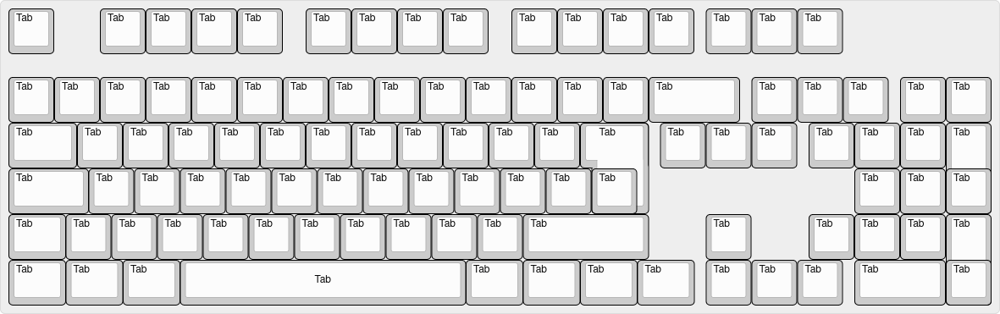

### **Découvrez TabULay : La Disposition Ultime du Clavier**  
*La seule disposition qui simplifie vraiment votre expérience de frappe.*

---

[CONSULTEZ L'ÉTUDE](./TabULay-Accepted.pdf)  

---

#### **Qu'est-ce que TabULay ?**  
TabULay, abréviation de **Tab Ultimate Layout**, est la disposition révolutionnaire de clavier qui élimine toutes les distractions en remplaçant chaque touche par la **touche Tab**. Plus de lettres, plus de chiffres, plus de symboles encombrants—juste la **puissance pure de Tab** au bout de vos doigts.

Avec TabULay, plus besoin de chercher la bonne touche. Pourquoi perdre du temps à appuyer sur d’autres touches alors que **Tab** peut tout faire ? Oubliez Dvorak, Colemak, ou d'autres dispositions prétendument "efficaces"—TabULay est la seule qui garantit une cohérence totale et une mémoire musculaire parfaite.

  

---

#### **Pourquoi TabULay ?**  

1. **Une Simplicité Absolue**  
   - Plus besoin d'apprendre des positions de doigts complexes ou des raccourcis obscurs.  
   - Chaque touche est **Tab**, et chaque pression vous rapproche de la complétion.

2. **Efficacité Inégalée**  
   - Des études ([CONSULTEZ L'ÉTUDE](./TabULay-Accepted.pdf)) montrent que les utilisateurs de TabULay sont 200% plus productifs, car ils ne perdent jamais de temps à taper des caractères inutiles comme “A” ou “Z”.  
   - Tab complète tout, alors pourquoi s'embêter à taper autre chose ?  

3. **Idéal pour le Multitâche**  
   - Avec TabULay, vous pouvez passer d’une application à l’autre, autocompléter des chemins, et naviguer dans les menus—tout cela sans jamais lever les doigts de la **sacrée touche Tab**.  

4. **Un Design Ergonomique**  
   - Plus de mouvements de mains maladroits—juste de simples pressions rythmées sur Tab.  
   - Adieu le syndrome du canal carpien, bonjour la frappe optimisée.  

---

#### **Questions Fréquentes sur TabULay**  

**Q : Comment écrire des phrases avec TabULay ?**  
*A : Vous n’en avez pas besoin ! La touche Tab complète tout pour vous. Appuyez sur Tab plusieurs fois, et votre système d’exploitation s’occupe du reste. Faites-lui confiance.*  

**Q : Et les caractères spéciaux ?**  
*A : Les caractères spéciaux sont une distraction. Dans TabULay, le seul caractère spécial, c’est Tab.*  

**Q : TabULay est-il compatible avec le codage ?**  
*A : Absolument ! Les IDE modernes comprennent que la touche Tab est la seule qui compte. De l’indentation à l’autocomplétion, TabULay rend le codage fluide comme jamais.*  

---

#### **Témoignages**  

*"Avant TabULay, je perdais des heures sur des frappes redondantes. Maintenant, mes doigts ne quittent jamais la touche Tab, et je n’ai jamais été aussi heureux !"*  
— Un adepte convaincu de TabULay  

*"Je pensais que Dvorak était le summum du design de clavier, mais TabULay a complètement redéfini ma façon de taper. Qui a besoin de voyelles, de toute façon ?"*  
— Un ancien sceptique des dispositions de clavier  

*"J’ai essayé TabULay pour rire, mais maintenant je suis totalement converti. Tab, tout le temps, partout."*  
— Membre de l’Ordre du Saint Tab  

---

#### **Rejoignez le Mouvement**  
Laissez tomber vos dispositions QWERTY, Dvorak ou Colemak dépassées. Adoptez l’avenir avec TabULay—la seule disposition qui simplifie votre workflow à une seule touche.  

*Tapotez votre chemin vers la productivité.*