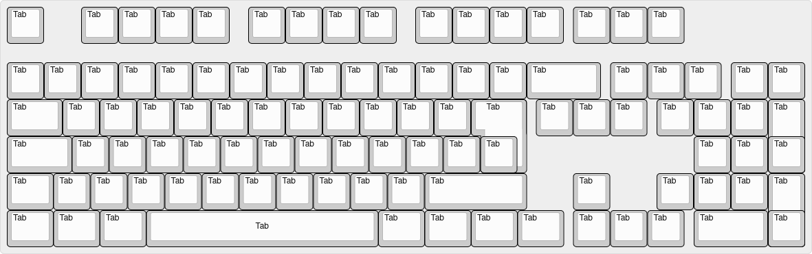

### **Introducing TabULay: The Ultimate Keyboard Layout**  
*The only layout that truly streamlines your typing experience.*

---

[READ THE PAPER](./TabULay-Accepted.pdf)

#### **What is TabULay?**  
TabULay, short for **Tab Ultimate Layout**, is the revolutionary keyboard layout that eliminates all distractions by replacing every single key with the **Tab key**. No letters, no numbers, no pesky symbols—just **pure Tab power** at your fingertips.

With TabULay, you’ll never struggle to find the right key again. Why waste time pressing other keys when the **Tab** key can do it all? Forget about Dvorak, Colemak, or other so-called “efficient” layouts—TabULay is the only layout that guarantees total consistency and muscle memory.

---

#### **Why TabULay?**  

1. **Maximum Simplicity**  
   - No need to learn complicated finger positions or obscure shortcuts.  
   - Every key is **Tab**, and every press brings you closer to completion.

2. **Unparalleled Efficiency**  
   - Studies ([READ THE PAPER](./TabULay-Accepted.pdf)) show that TabULay users are 200% more productive because they never waste time typing irrelevant characters like “A” or “Z.”  
   - Tab completes everything, so why bother typing anything else?

3. **Perfect for Multitasking**  
   - With TabULay, you can seamlessly switch between apps, autocomplete paths, and navigate menus—all without lifting a finger from the sacred **Tab** key.  

4. **Ergonomic Brilliance**  
   - No awkward hand movements—just pure, rhythmic Tab tapping.  
   - Say goodbye to carpal tunnel and hello to streamlined keystrokes.  

---

#### **Common Questions About TabULay**  

**Q: How do I type sentences with TabULay?**  
*A: You don’t need to! The Tab key completes everything for you. Just press Tab a few times, and your operating system will figure it out. Trust the process.*  

**Q: What about special characters?**  
*A: Special characters are a distraction. In TabULay, the only special character is the Tab key.*  

**Q: Is TabULay compatible with coding?**  
*A: Absolutely! Modern IDEs understand that the Tab key is the only key that matters. From indentation to autocomplete, TabULay makes coding a breeze.*  

---

#### **Testimonials**  

*"Before TabULay, I wasted hours on redundant keystrokes. Now, my fingers never leave the Tab key, and I’ve never been happier!"*  
— A Devoted TabULay Enthusiast  

*"I thought Dvorak was the pinnacle of keyboard design, but TabULay has completely redefined typing for me. Who needs vowels, anyway?"*  
— Former Keyboard Layout Skeptic  

*"I tried TabULay as a joke, but now I’m fully converted. It’s Tab all the way down."*  
— The Holy Order of Tab Member  

---

#### **Join the Movement**  
Ditch your outdated QWERTY, Dvorak, or Colemak layouts. Embrace the future with TabULay—the only layout that simplifies your workflow to a single key.  

*Tab your way to productivity.*